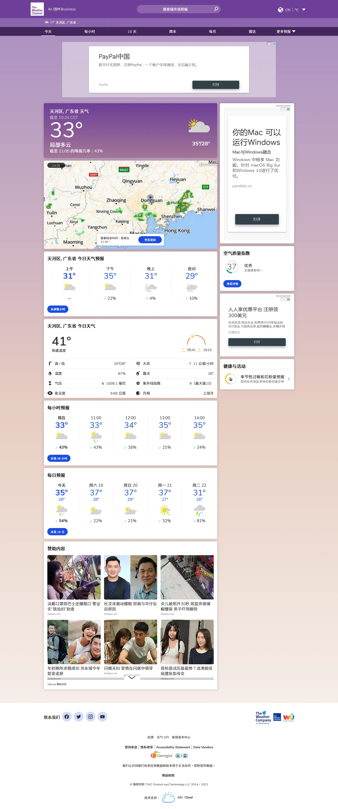
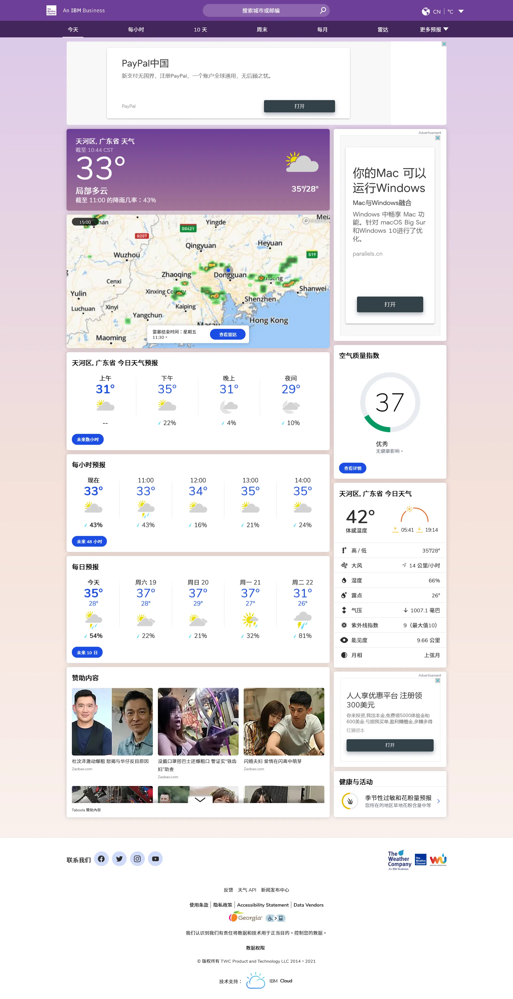
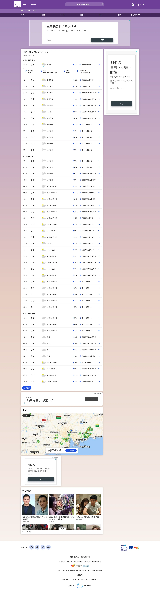
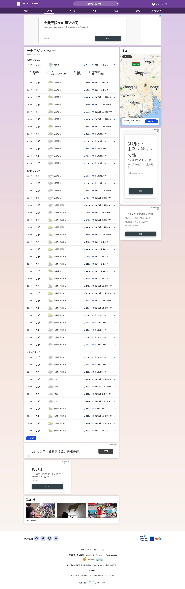
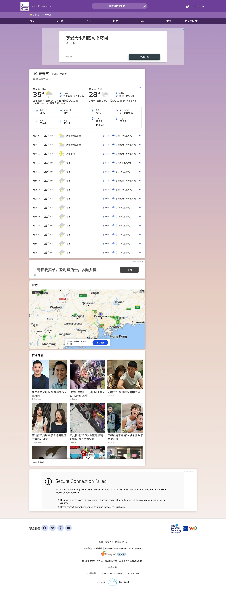
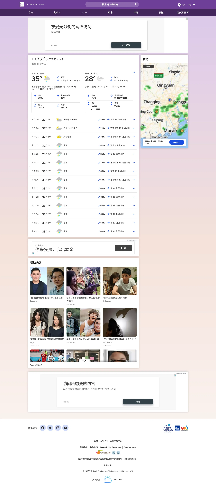

# IBM Weather UI

An enchanced UI for weather.com

* Better card layout
* Larger place for content
* Better font style
* Less satuated color
* Higher contrast icon for an ease of eyes

## Comparation

Original&ensp;&ensp;&ensp;&ensp;&ensp;&ensp;&ensp;&ensp;&ensp;&ensp;&ensp;&ensp;&ensp;&ensp;&ensp;&ensp;&ensp;&ensp;&ensp;&ensp;&ensp;&ensp;&ensp;&ensp;&ensp;With this UI

  
  

  
  

  
  

